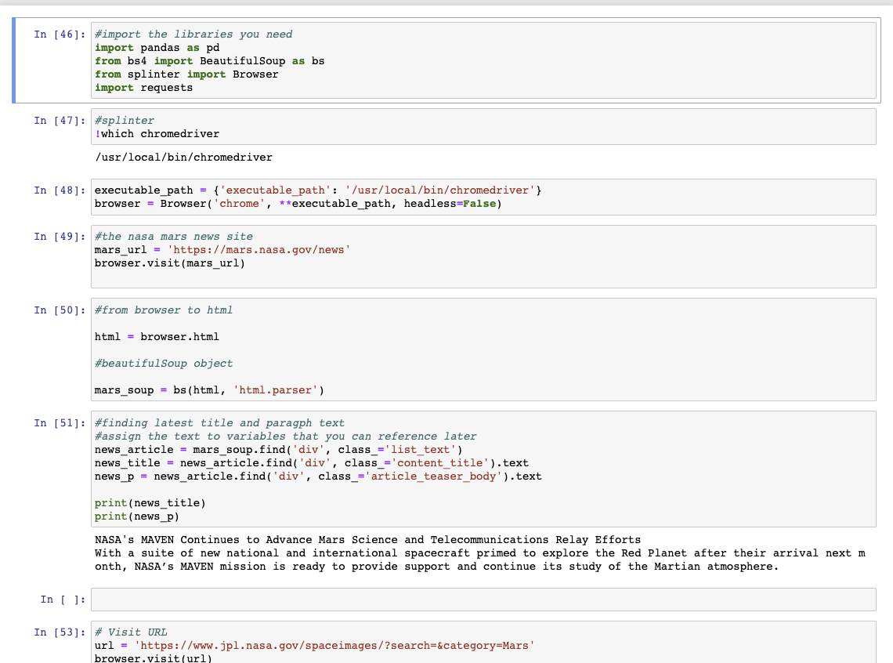
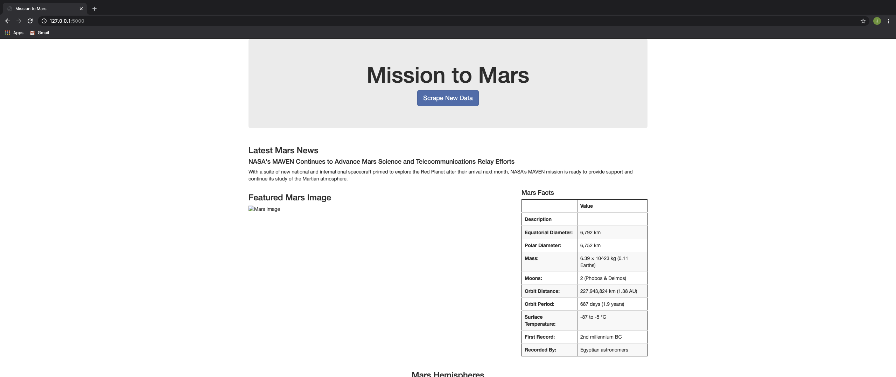
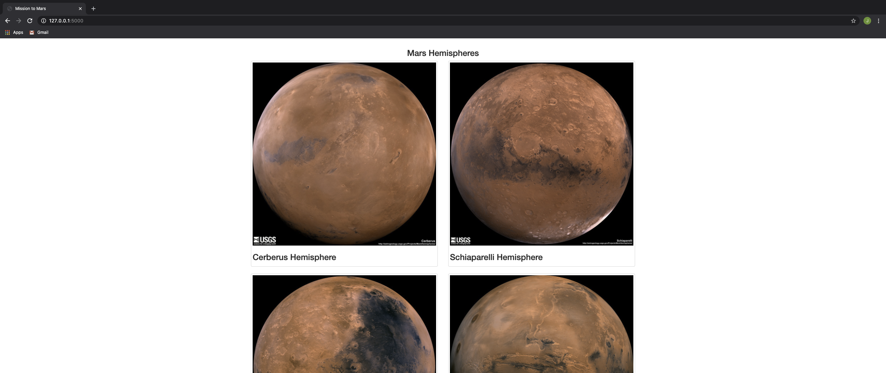

# Mission to Mars

## Background

A web application that scrapes various websites for data related to the Mission to Mars and displays the information in a single HTML page.

## Scraping

Initial scraping using Jupyter Notebook, BeautifulSoup, Pandas, and Requests/Splinter. The [NASA Mars News Site](https://mars.nasa.gov/news/) was scraped to collect the latest News Title and Paragraph Text. The [JPL NASA site](https://www.jpl.nasa.gov/spaceimages/?search=&category=Mars) was scraped via splinter to find the image url for the current Featured Mars Image. The [Mars Facts webpage](https://space-facts.com/mars/) was scraped via Pandas to obtain the table containing facts about the planet. The [USGS Astrogeology site](https://astrogeology.usgs.gov/search/results?q=hemisphere+enhanced&k1=target&v1=Mars) was scraped to obtain high resolution images for each of Mar's hemispheres.
 

## MongoDB and Flask Application

With MongoDB and Flask templating, an HTML page was created to display all the information that was scraped from the URLs above:

